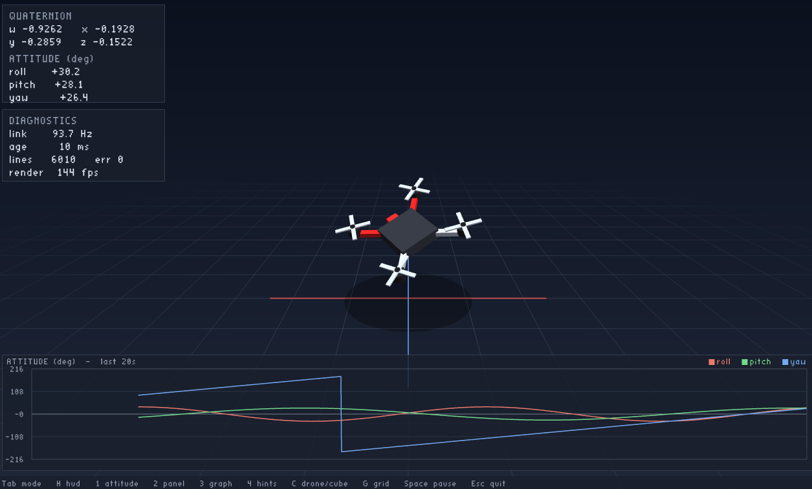
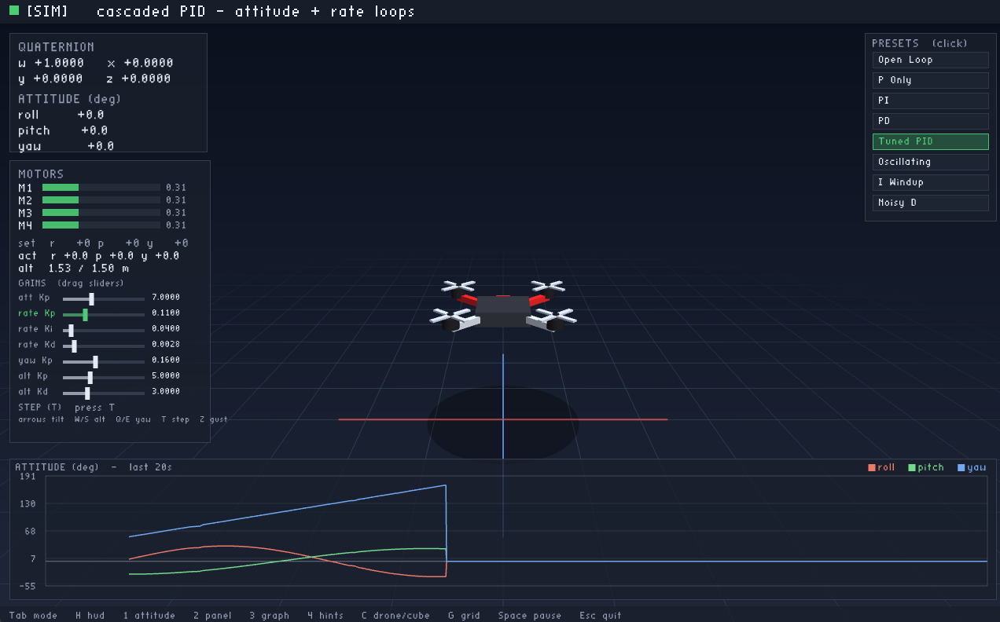

# Avionics Visualizer & Flight-Controller Simulator

TL;DR this is a simulator and work environment for me to prototype my quadcopters

A real-time 3D attitude visualizer and cascaded-PID flight-controller workbench, written in
Java with LWJGL/OpenGL. It renders vehicle orientation live from an IMU over serial, and
includes a physics-based quad simulator for designing and tuning the motor-control loops.

Two modes share one rendering + HUD pipeline (press **Tab** to switch):

- **LIVE** — streams quaternion attitude from a microcontroller IMU (Arduino / STM32) over
  serial and renders it in 3D. A built-in mock source lets it run with no hardware attached.
- **SIM** — a rigid-body quad stabilized by a cascaded PID controller. Drive the setpoint,
  inject disturbances, tune gains live, and evaluate the step response.

## Screenshots

### LIVE mode
<!-- screenshot of LIVE mode here -->


### SIM mode
<!-- screenshot of SIM mode here -->


## Features

- Real-time 3D rendering of a procedural quadcopter with a depth-faded reference grid and a chase camera
- Quaternion attitude math (no gimbal lock)
- Live IMU telemetry over serial (jSerialComm), with a hardware-free mock source
- Quad rigid-body dynamics (Euler's equations + quaternion kinematics) with motor lag and altitude hold
- Cascaded PID flight control: attitude (P) → angular-rate (PID) → X-quad motor mixer
- PID-tuning workbench: mouse-draggable gain sliders, 8 behavior presets
  (Open Loop, P, PI, PD, Tuned PID, Oscillating, I-Windup, Noisy D), and a step-response
  analyzer (rise time / overshoot / settling time)
- Heads-up display with attitude readouts, motor outputs, and scrolling time-series graphs
- Sensor-noise injection and gain export to C `#define`s for firmware

## Build & run

Requires JDK 24 (uses preview features) and Maven.

```bash
mvn compile
mvn test        # headless physics/control tests
```

To launch (Windows):

```powershell
.\run-demo.ps1
```

Or run the `com.kagenou.avionics.Main` class from your IDE.

## Controls

**Global:** `Tab` switch mode · `H` toggle HUD · `1` attitude · `2` panel · `3` graph ·
`4` hints · `C` drone/cube · `G` grid · `Space` pause · `Esc` quit

**SIM:** arrows tilt (roll/pitch) · `Q`/`E` yaw · `W`/`S` altitude · `T` roll-step +
analyze · `Z` gust · `N` sensor noise · `0` level · `R` reset · `[` `]` select gain ·
`-` `=` adjust · **mouse:** drag gain sliders, click presets

**LIVE:** `R` recenter · `M` mock/live source

## Project structure

```
src/main/java/com/kagenou/avionics/
  Main.java
  core/    Engine, AppConfig, Controls      (window, config, input)
  io/      serial + mock attitude sources, quaternion parsing
  math/    Quaternion
  scene/   drone model, ground, background, primitives
  hud/     HUD, panels, time-series graphs, text rendering
  sim/     QuadDynamics, FlightController, Pid, StepAnalyzer, Simulator
  app/     Mode interface, LiveMode, SimMode
src/test/java/com/kagenou/avionics/
  math/ + sim/   JUnit 5 tests for the headless physics/control logic
```
